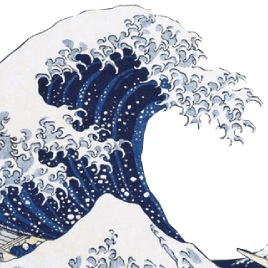

<!-- AUTO-GENERATED-CONTENT:START (STARTER) -->
<p align="center">
  <a href="https://spdevuk.com">
    
  </a>
</p>
<h1 align="center">
  My portfolio
</h1>

My personal portfolio. Forked from [Gatsby blog starter](https://github.com/gatsbyjs/gatsby-starter-blog).

## ✨ Features

- Light/Dark theme toggle based on CSS variables
- Code syntax themes based on theme selection
- Markdown based blog
- Markdown based projects layout including a carousel for featured projects
- Cool blurry navbar in Apple style
- Fully accessible by keyboard only
- Blazing fast™

## 🚀 Dev setup

- Install dependencies : `npm i` (you may need to install `vips`: `brew install vips`)
- Start dev server: `npm start`
- visit http://localhost:8000

## ✈️ Production setup (local)

- Build latest changes: `npm build`
- Serve it locally: `npm serve`
- visit http://localhost:9000

## 🥳 How to add a blog or project

- Create a folder under /blog e.g `new-blog-post`
- Add a markdown file to generate a page `index.md`
- Include some frontmatter to the top of the file to give info about the page:

  ```
    ---
    title: How to use DigitalOcean Spaces as a CMS # title to display
    date: 2020-11-08T18:14:47.654Z # new Date() - recent posts are marked with new
    type: digitalocean # which icon to use, e.g digitalocean = digitalocean.svg inside content/assets/
    action: copy # copy = copy button on code blocks, code = runs code on code blocks
    ---
  ```

- Add images if you wish into the folder and use them in the markdown e.g ``
- Visit the blog page and see the new post at the top of the list

The same can be done for a project, except into the `/projects` folder:

- A project also has a preview, so add `image: "./preview.jpg"` to the frontmatter and include a preview image in the folder
- A project can also be featured (on the top carousel): add `featured: true` or `featured: false` to the frontmatter
