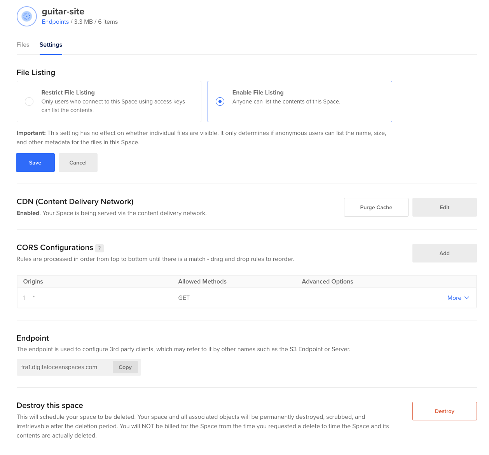
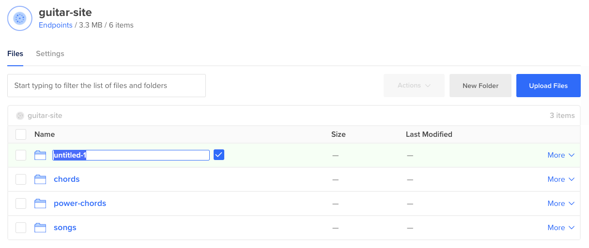
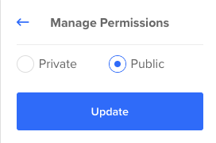
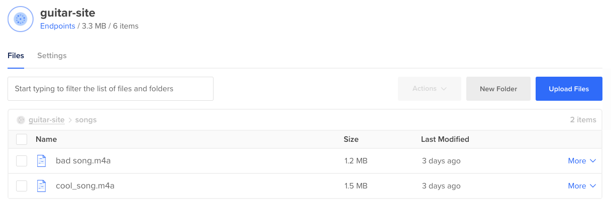
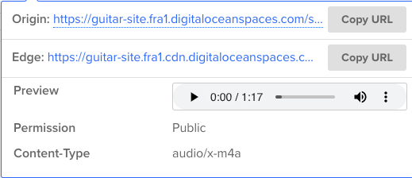
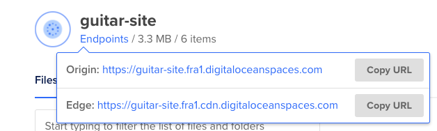
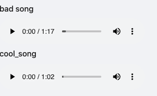

I recently had a problem where I wanted to upload an unknown amount of audio files *(me terribly playing the guitar)* but I had no idea where to upload them in a way that would allow me to also display them on a website.

There were a few things that came to mind, but in the end, I settled on using either [AWS S3](https://aws.amazon.com/s3/) or [DigitalOcean Spaces](https://www.digitalocean.com/products/spaces/). I opted for DO Spaces because the setup is much easier and the pricing is simple. I pay $5/month and they give me a CDN set up so I can serve my files quickly to anywhere in the world.

My goal was to have a "drag and drop" experience that would magically update my website with the new files, no server needed, just a frontend website that finds what's available and then shows it to the world, super simple.


### Requirements

- a [DigitalOcean Space](https://www.digitalocean.com/products/spaces/) ($5/month)
- Basic understanding of asyncronous JavaScript and functional programming

### How to use the space

First, you'll want to figure out your structure, for me I wanted to separate my audio files into different folders like so:
```
/
|── chords
|   |── d-chord.m4a
|── power-chords
|   |── e-power-chord.m4a
|── songs
|   |── satisfaction.m4a
```

That way I'll be able to have 3 different pages on my site, each page containing the audio files in that folder that corresponds to the page you're currently on.

Using the API DigitalOcean we can then make an API request to list all of the files in the bucket. With a bit of data restructuring, we can then separate each folder into their own array containing all the files in that folder. Once we have that structure all we'll need to do is create an element for each entry in the array. 


#### Setting up the space files

First things first, you'll need to allow any website to make a GET request to your API endpoint and set up public file listing. This basically means you can make a request and list all the files in your bucket, which we'll need to do to grab all the URLs and list them on our site. 




*Later on when you're in production you can lock down the CORS configuration to just your domain, but for now, setting it to `*` lets us use localhost development.*


Then you'll need to click `New Folder` and create some folders that make sense for your project.



Then you'll need to drag and drop files into each folder. When asked if you want the file to be public select yes. If you select no by accident you can always open a folder and click on `More -> Manage Permissions` and set a file to be public.




You should now have file(s) uploaded into a folder and it should look something like this:




Now you can see there's a URL for the file available to you where you can view/download the file.





### Using the space to display media on a website

We *could* manually hard-code the URLs into our website, this works fine, however, it's very tedious. Adding a new file would then mean needing to go into the code and add it in manually, every single time. We don't want to do that.

Our goal is to have everything in 1 folder appear on a specific page. So let's get started making an API request and get a list of our URLs coming back.

You can find the root endpoint by hovering over "Endpoints", copy the `edge` endpoint to your clipboard.



You can make a GET request directly to this endpoint, it will return with a response that includes the structure of the folder in XML format. Sadly that isn't enough for us to easily then display everything on the screen.


We'll install some libraries to help us transform this XML into a reasonable structure to work with:
- [xml2js](https://www.npmjs.com/package/xml2js) - to convert the XML to JSON 
- [ramda](https://www.npmjs.com/package/ramda) - to give us some utility functions
- [axios](https://www.npmjs.com/package/axios) - to replace `fetch()`, a nice to have


We'll then create a function that will make a request to our endpoint and return a much nicer structure to work with.

I'll let the comments explain how it works, but essentially we are turning a structure from XML to a JS object, then turning that object into a much nicer structure where each key is the folder name and the value is an array of objects that contain info about that file.

```js
import axios from 'axios';
import xml2js from 'xml2js';
import { groupBy, map } from 'ramda';

// replace this with your space CDN link!
const BUCKET_URL = 'https://.....cdn.digitaloceanspaces.com';

export const fetchBucketFiles = async () => {
  const { data } = await axios.get(BUCKET_URL);

  // destructure Conents from the xml, rest is metadata about the space/bucket
  const { ListBucketResult: { Contents } } = await xml2js.parseStringPromise(data);

  // all we care about is the Key from this object as it contains the filename in position 0
  // rest of the object is metadata e.g lastModified, Owner so we simply map and select the Key[0]
  const fileNames = Contents.map(({ Key }) => Key[0]);

  // groupBy folder name, use custom function to return folders into the "folder": key
  // e.g chords/one.m4a will go into {"chords": "chords/one.m4a"}
  const groupedFiles = groupBy((key) => {
    if (key.endsWith('/')) return 'folder';
    const [folder] = key.split('/');
    return folder;
  }, fileNames);

  // remap each of the arrays in the object from ["chords/chord.m4a"] to [{url: "https://..../chords/d-chord.m4a", title: "d-chord"}] 
  const renamedFiles = map(map((filename) => {
    // split between the / and the file extension .
    const split = filename.split(/[/.]/);

    // get the 2nd last element, the last element (the filename), last is the file extension
    const title = split[split.length - 2];

    const url = `${BUCKET_URL}/${filename}`;

    // return a url and the title so we can easily display it in the UI
    return { url, title };
  }), groupedFiles);

  // {chords: [{url: "...",  title:"..."}], songs: [{...}]}
  return renamedFiles;
};
```


You can now use this function to make a request that will respond with a nice structure we can loop over.

```js
const files = await fetchBucketFiles();
/*
  this will return: {folder: Array(3), chords: Array(1), songs: Array(2)}

  example of songs array:

 [{url: "https://guitar-site.fra1.cdn.digitaloceanspaces.com/songs/bad song.m4a", title: "bad song"}
 {url: "https://guitar-site.fra1.cdn.digitaloceanspaces.com/songs/cool_song.m4a", title: "cool_song"}]
*/
```
Now everything is in a pretty format all we need to do is add the data onto the screen by looping over the array.

Here's an example of that in React:
```js
{files.songs.map(({url, title}) => (
  <div key={url}>
    <h1>{title}</h1>
    <audio controls><source src={url} type="audio/ogg" /></audio>
  </div>
))}
```


If everything has worked correctly you should see songs appear on the screen! 🎉





Hopefully, that gives you a nice idea of how you can create a mini-CMS using just a DigitalOcean space and dragging filenames into folders! All you'll need to do is drag & drop and the API request will **automatically** have the changes picked up and display them on your website. 😎


You can check out a working example here: [https://guitar-site.netlify.app/](https://guitar-site.netlify.app/)

And the source code here:[https://github.com/SPDUK/guitar-site](https://github.com/SPDUK/guitar-site)