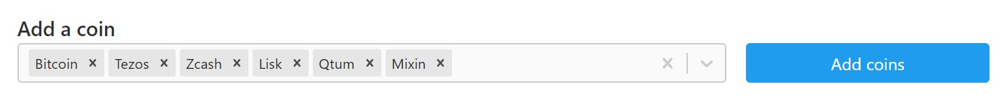
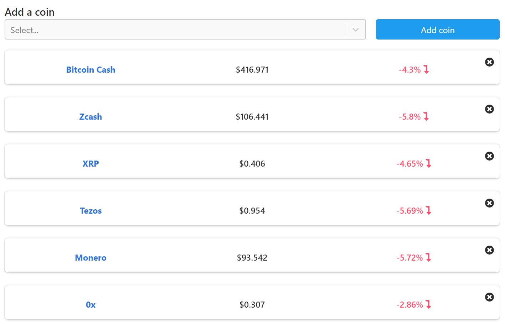

#### A full stack React & Rails site to track current cryptocurrency prices.

[View Site](https://spduk-crypto.herokuapp.com/#/) | [Code on Github](https://github.com/SPDUK/Crypto)

---

Tools Used: [React](https://reactjs.org/), [MobX](https://github.com/mobxjs/mobx), [Ruby on Rails](https://rubyonrails.org/), [PostgreSQL](https://www.postgresql.org/)

---

### The API being used is blocked by adblockers, so please disable any adblockers or data won't load correctly.

_also being hosted on heroku so it may take 10 seconds to load._

#### What I learned

- How to create a Full Stack React & Rails application, using JWT to authorize users within rails.

- How to seed a database, placing initial API data into the database with a seed file.

- Improved upon React best practices, responsive design and integrating an interactive background.

#### What it does

Uses react to handle user signups and logins, showing the current price of various cryptocurrencies on the landing page, enabling users to sign up and begin tracking their cryptocurrencies of choice.

Users can add currency to their personal list of currency they wish to track, featuring an intuitive and easy to use search bar that allows a user to select multiple currencies at once in a single API call.

Once cryptocurrencies have been added to a user's account, the Rails back-end is then notified of the updates, modifying the user 's tracked cryptocurrencies.

The user can then open the site whenever they wish to see the current state of their favourite cryptocurrencies, adding and removing them as they please.

