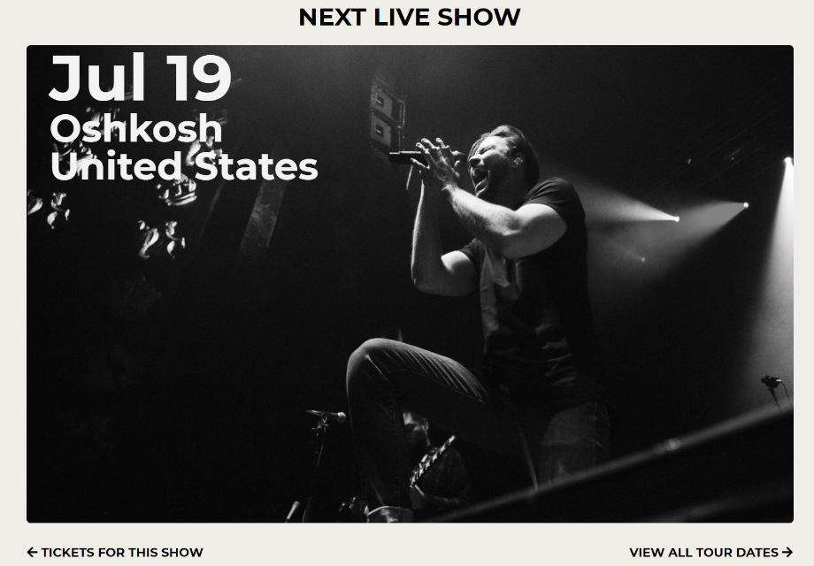

##### A fan-made site for the band Dance Gavin Dance

[View Site](https://spduk.github.io/dgd/#/) | [Code on Github](https://github.com/SPDUK/dgd)

---

Tools Used: [React](https://reactjs.org/), [Sass](https://sass-lang.com/), [BandsInTown API](https://www.bandsintown.com/)

---

#### What I learned

- The basics of React. (React Router, Component Lifecycle, State).
- How to make API requests and use promises.
- Using Sass variables and mixins.

#### What it does

It's a simple landing page style website that uses the [BandsInTown API](https://www.bandsintown.com/>) to list the most recent tours that are happening for the band, as well as listing all of the albums, with links to listen to that album on YouTube.

After fetching the API response, the text is positioned over the image to make it look like it's part of the image.

There's also another page that has the next year of tour dates listed, with a link to get tickets for each of them.
