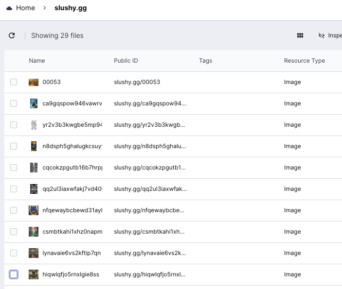

#### A site to host my AI generated images

[View Site](https://www.slushy.gg) | [Code on Github](https://github.com/SPDUK/www.slushy.gg)

Tools Used: **[Next.js](https://nextjs.org/), [Cloudinary API](https://cloudinary.com/)**

#### How it works

The site is a Next.js app that uses the Cloudinary API to fetch images from a folder that I can drag & drop into the Cloudinary dashboard, which then automatically updates the list of images displayed on the site without me having to do any redeploy or developer related work.

Images are then optimized by cloudinary and cached on their CDN, which means I can also skip the step of optimizing images myself and just use the original high quality images that I generate locally.

Otherwise it's a pretty basic site that simply loops over the API results and displays them in a pretty layout! 😄

#### Images

The images are generated locally using Stable Diffusion, mostly using an [SDXL](https://stablediffusionxl.com/) model which can generate much higher resolution images than the original Stable Diffusion model, and often times I then upscale the images even further to 2k or 4k. 

The general strategy for generating high quality images is to generate a 1024px image that looks somewhat like what I'm wanting to create and then refine it using img2img with ~0.4 noise which fixes any minor issues e.g artifacts, extra fingers, incorrect eyes etc. Then I upscale the image to 2k or 4k using ESRGAN_4x, which is a model trained to upscale images 4x their original size, resulting in an image that looks crisp and has no deformities or artifacts.

The images can be downloaded or viewed in full resolution by clicking on the shortcut that pops up when you're viewing a specific image, each link simply takes you to the full version of the image on Cloudinary. 

